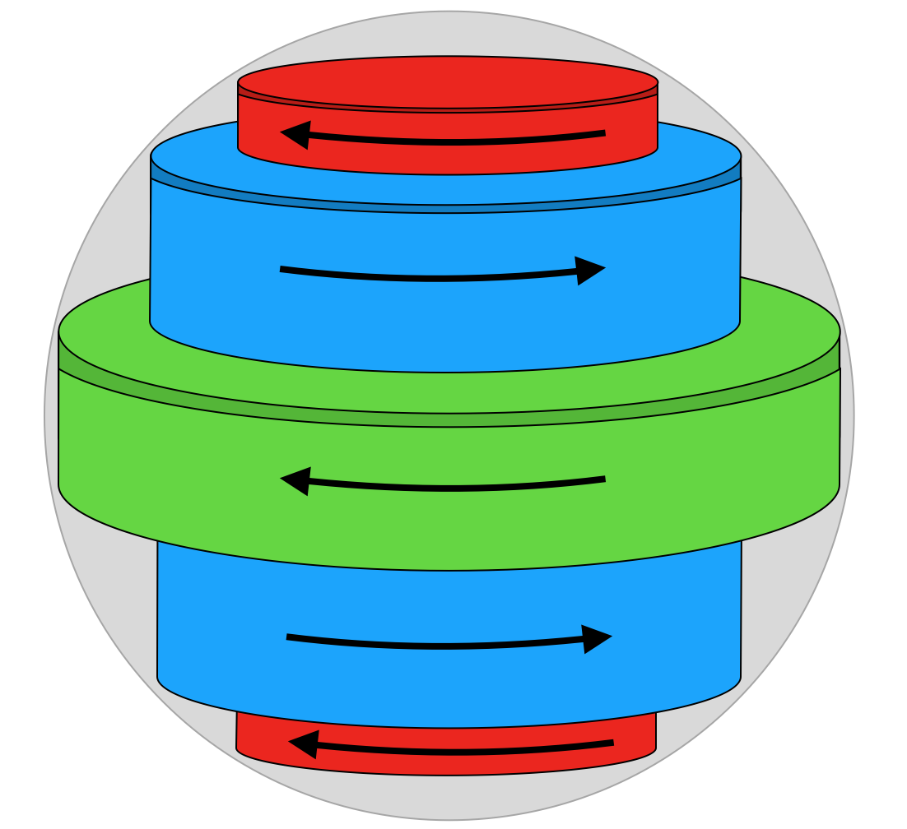
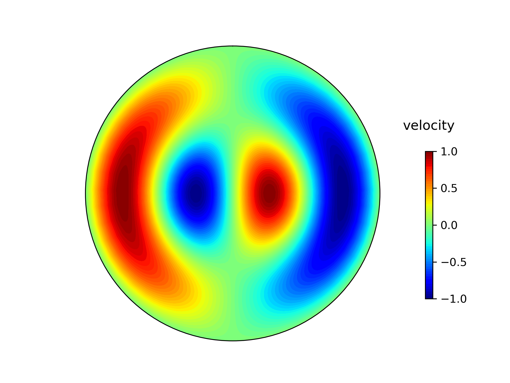
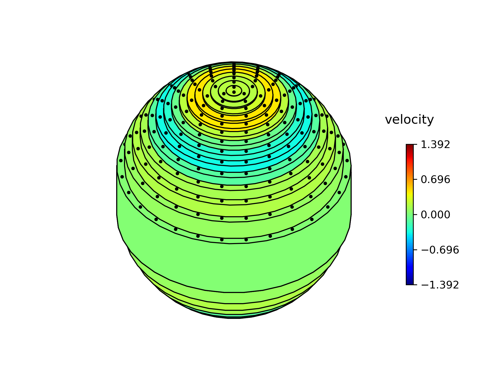

# Summary

core_flow provides a simple set of python visualisation tools for 2D flow velocity data from fluid planetary interiors. It is mainly intended for animating torsional wave models for publication and presentation purposes. core_flow is a lightweight module built only upon the common numpy/matplotlib python packages and is free to be used and modified as the user requires. It may also be used for contouring and animating any set of 2D dataset such as other components of fluid velocity from models/simulations in polar coordinates.

# Background

The dynamics of liquid planetary cores is fundamental to planetary-scale phenomena such as the generation of a magnetic field. Understanding the relevant processes is a complex task because the fluid motion includes a wide range of convective and oscillatory behaviour. Visualisation of models, based either on observational data or computer simulations, is a key part of both scientific exploration and communication particularly to non-specialist audiences.

In rapidly-rotating planets such as Earth, one important type of dynamical behaviour is longitudinal 'torsional' oscillations of concentric cylinders aligned with the rotation axis, each of which spans the height of the spherical core.

  

**Figure 1.** Cartoon conceptually showing the differential rotation of fluid cylinders within a sphere.

From an initial starting configuration, the azimuthal velocity distribution of the cylinders propagates across the core owing to the restoring force of the magnetic field that threads through the cylinders. Because of this modulating effect from the magnetic field, observations of torsional oscillations can constrain the strength of the magnetic field hidden deep inside the core.

Although torsional oscillations, given by the azimuthal component of velocity, $u_\phi$, can be fully described by static 2D (the cylindrical radius, $s$ and time, $t$) diagrams [@gillet2010fast; @cox2014forward; @hide2000angular; @teed2018torsional] , such visualisations do not communicate the geometry of the waves within the spherical core.

 In this paper, we present a simple python module which takes planetary core flow data (in polar coordinates) and produces either static plots or animations of it. Data that varies spatially in both radius and azimuth can be contour plotted (figure 2) whilst torsional wave data may be visualised by cylinders in either a 2D or 3D view (figure 3). To make the cylindrical movement visible, we add a dotted-texture to each cylinder, which is advected as a tracer.

**Figure 2.** Simple contour plot of example data that varies sinusoidally in radius and azimuth.

**Figure 3.** 2D visualisation of data from Cox et al. [@cox2014forward] approximated to 15 cylinders The velocity scale shown is non-dimensional.

**Figure 3.** 3D visualisation of the same data as the previous figure.

#### Benefits of core_flow include:

* The tools require only the commonly available Python packages numpy and matplotlib.
* Generating an animation can be done in just 1 line of code.
* All plots and movies are of publication grade, with user choices for the resolution and frame rate of saved images/movie files.
* The matplotlib animations draw fast enough to be suitable to be viewed live without the need to encode to a movie file first.

# Acknowledgements

We would like to acknowledge contributions from Grace Cox in both feedback on the animations and the use of her data for the example figure.

# References
